*Accuracy of BMI & an Alternative Measure of Body Fat*
======================================================

One of the most accurate ways to calculate body fat levels is underwater weighing. This measures body density, which is then used in Siri's 1956 equation to calculate a precise body fat percentage. It is expensive and impractical for large research projects on human body fat levels so researchers typically rely on cheaper alternatives. Even then, the more accurate methods are impractical for wide scale research. Skin-fold measurement, for example, requires callipers and training for accurate readings. So research is invariably carried out with Body Mass Index (BMI); a ratio of mass and squared height.

The aim of this paper is to assess the accuracy of BMI in describing human body fat levels and to investigate potential BMI alternatives. Siri's Body Fat Percentage (BFP) is taken as an objective measure of human body fat levels. The healthy weight categories of different BFPs are based what is physiologically healthy and unhealthy.

A sample of 252 men was measured for BFP. The sample was also measured on variables hypothesised to have predictive value in determining BFP, including age, weight, height and the circumference of ten different body parts (e.g. abdomen, chest, etc.). These variables will form the foundation of an alternative body fat measure to BMI.

The analysis has four parts. The first part involves creating a BMI variable from height and weight data, then two new variables categorising participants into underweight, normal and obese groupings based on predetermined value boundaries. The data will also be explored in this section with a focus on outliers and normality. The second part of the paper will start with an initial comparison between BMI and BFP categories, moving on to an overview of the relationships between BFP and the predictor variables. Third, ANOVA will determine whether age differences in BFP categories are captured by BMI categories. The fourth part of the analysis will directly address the aim of the paper. It will determine the value of BMI in predicting BFP and then compare this to the value of the other simple measures (i.e. body dimension variables) in predicting BFP.

Analysis
========

Part 1. Exploring the data set
------------------------------

PROC SGPLOT was used here and extensively in other sections of the report. It has a variety style options and can be used to convey large amounts of information in a single figure. The analysis began with PROC UNIVARIATE to find outliers. Five outliers were found in the numeric variables. These included extreme body fat percentages (0%, 0.7%, 47%), weights (363 lbs), dimensions and data entry errors (29in tall). With so few outliers to deal with, the cases were simply deleted, which should lead to fewer problems in subsequent analysis than other corrective measures.

To review normality, tests of normality are an option, but are usually too sensitive with samples of this size. A review of kurtosis and skewness for all variables was used as an alternative. The OUTTABLE options in UNIVARIATE exported skewness and kurtosis to a new dataset, allowing review of all variables in a single SGPLOT, shown in Figure 1 below.

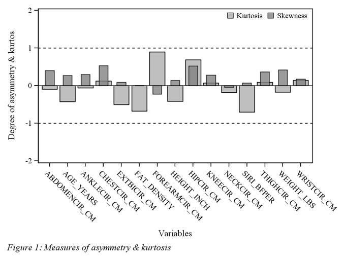

Asymmetry and kurtosis of <sup>+</sup>|<sub>-</sub> 1 are acceptable on a conservative standard. Figure 1 shows that none of the variables have exceeded that limit, so normality is assumed.

The new numeric variable BMI was calculated from weight and height. One outlier was removed because of an extreme BMI of 39. This case also had the highest chest circumference while only an above average body fat percentage, suggesting that they may be unique and not representative of the population (e.g. body-builder, physical abnormality, etc.). Frequencies of the two new rating variables were extracted via PROC TABULATE. These variables categorised the sample according to standard BFP and BMI groupings for humans that are underweight, normal weight or obese.

Table 1. *Frequencies of Body Fat% and GMI health rating.*

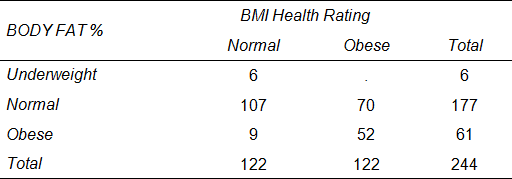

According to Table 1, in this sample the underweight category was very small for BFP and does not exist for BMI. As such, these groups cannot be used in some procedures. Importantly, there is a great deal is disparity in how the two measures rate fat health levels. This will be explored further in Part 2.

Part 2. Analysing relationships
-------------------------------

Some relationships between the variables where investigated through SGPLOT and correlations. This started by comparing BFP and BMI categories. This comparison shows how well the less precise human fat statistic of BMI matches the more precise measure of BFP (see Figure 2).

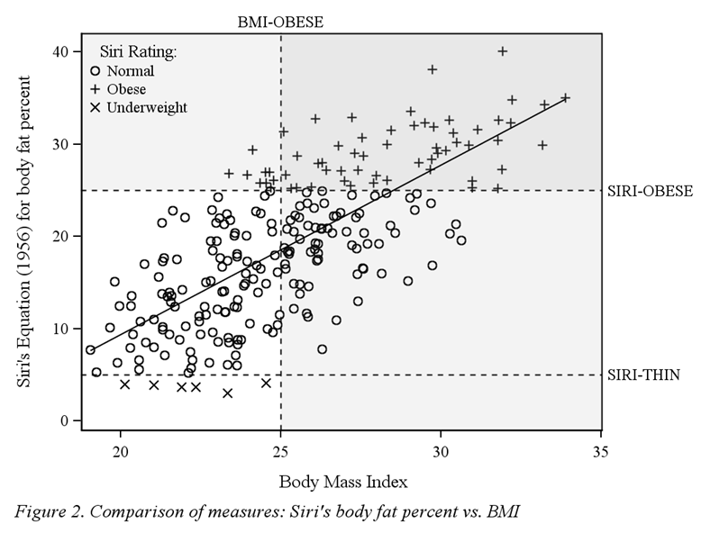

The Figure 2 scatter plot compares BFP and BMI with a line of best fit to show the relationship. Overall, there is a strong linear relationship, which was to be expected. However, comparing individual cases by their fat level categories (i.e. underweight, normal, obese) reveals a major shortcoming of BMI. Not only are large portions of the sample with normal body fat (objectively measured by BFP) classed as obese, but nine obese and six underweight participants are classed as normal.

An aim of this paper is to determine the efficacy of various body dimension measures to predict BFP. Correlations of these measures with BFP, along with some other variables, serve as initial step of this aim. PROC CORR produced the relevant correlations, which were exported via ODS OUTPUT into a dataset and presented below via SGPLOT below.

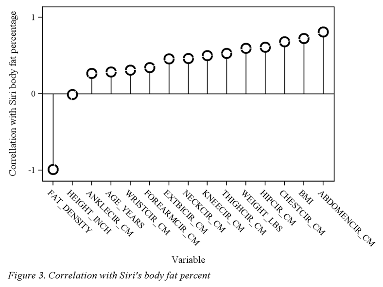

Figure 3 shows that all the variables were correlated with BFP except for height. Fat density was so strongly associated with BFP because it is used in the Siri BFP equation. These Pearson correlations were significant at the *p*\<.001 level. This information is useful because it shows which variables should be included in the Part 4 multiple regression model.

Part 3. Differences between groups
----------------------------------

The size of the underweight BFP group makes PROC ANOVA an inappropriate tool for analysis. However, dot plots with error bars are a useful tool in checking quick comparisons for significance. Two dot plots were produces to test age differences.

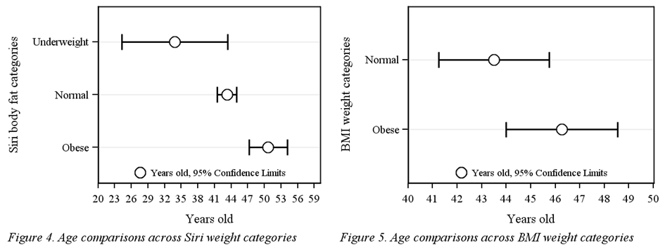

The Figure 4 confidence limits for the underweight group are inflated due to that group having only six participants. The bulk of the sample is in the normal group, which explains why those confidence limits are so narrow. There are no significant age differences between the underweight and normal group. However, the obese group is significantly (*p*\<.05) older than the other two groups, meaning that as males reach middle age their body fat is likely to increase. A larger sample might be able to demonstrate whether this is true for underweight to middle groups as well (e.g. as people move from their 20s to 30s).

With Figure 5, note that the *x*-axis for BMI comparisons is a much narrower. BMI has split the sample in half producing narrow confidence limits and no difference in age between the groups. This would suggest that if there are age differences in fat levels the BFP measure has captured them while the less sensitive BMI measure has not.

Part 4. Predictive power and model building
-------------------------------------------

Both BMI and the dimension variables are potential alternatives to underwater weighing and Siri BFP equations. The precision of BFP as a measure of body fat makes it an ideal dependent variable in testing the efficacy of other body fat measures. How well they predict BFP determines the efficacy of these alternatives.

PROC REG produced the regression models. Loess smoothers with low smoothing parameters allow graphical assessment of the prediction accuracy and supplement traditional fit diagnostics. In contrast to linear lines of best fit, Loess smoothers also highlight areas along the BFP scale where the model is weakest.

BMI was assessed first via a simple linear regression.

Table 2. *ANOVA table of BMI simple regression modelling BF%*

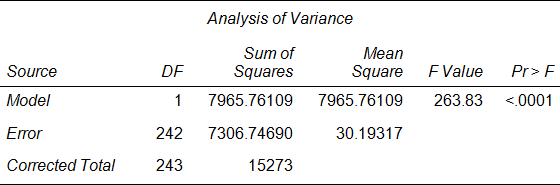

BMI was highly significant (*p*\<.0001) with a Root MSE of 5.49 and an R2 of 0.5216, predicting 52% of the variation in BFP. Fit diagnostics and plots showed that residuals were normally distributed, homoscedastic and without outliers. The predicted values were exported from the model and plotted against the original BFP. As noted above, a Loess smoother was used to provide a visual representation of prediction accuracy.

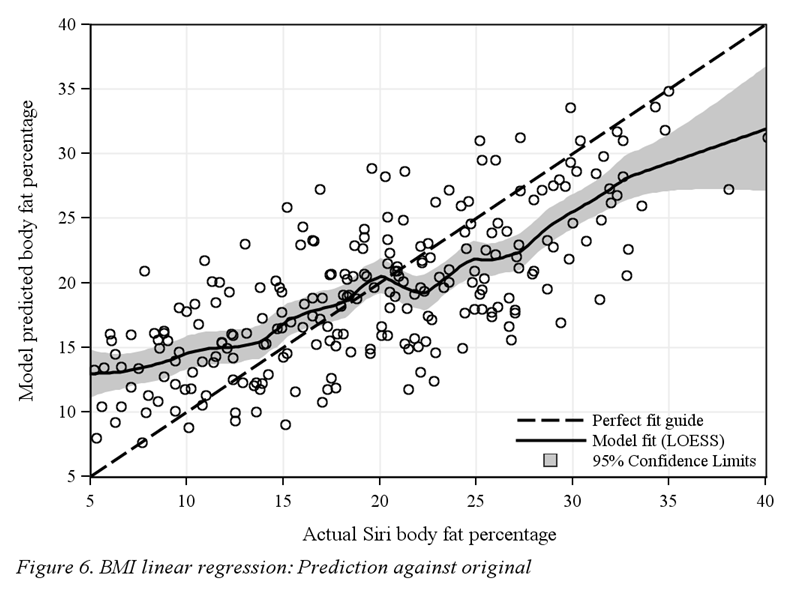

This plot shows that the BMI model is acceptable but flat. Predicted values do not increase at the same rate as actual values. Moreover, the model suffers from some instability at the 20% actual body fat mark, with the Loess showing a brief reverse in relationship.

A stepwise selection method was used for the multivariate regression. Fat density and height were not included because fat density is part of the Siri equation (perfect correlation), and Part 2 correlation analyses showed that height has no correction with BFP. All remaining variables were added to the model.

The first regression reached a solution in four steps with four variables in the model (*R*<sup>2</sup>=0.72). However, analysis of the Variance Inflation Factors showed that multicollinearity was a concern for weight, which had the highest VIF of 6.4. It was removed and another stepwise regression was run. A solution was reached in five steps with five variables.

Table 3. *ANOVA table of multiple regression modelling BF%*

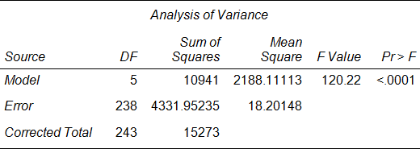

The multiple regression model was highly significant at the *p*\<.0001 level with a Root MSE of 4.26 and an *R*<sup>2</sup> of 0.7164, predicting 72% of the variation in body fat percentage. Therefore, the multivariate model explains 20% more variability with less error.

Table 4. *Summary of Stepwise multiple regression selection*

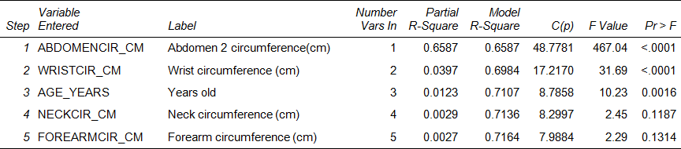

Table 4 shows the contribution of the different measures. The majority of variability is explained by abdomen circumference. The remaining factors are small or non-significant, and would be removed by a stricter alpha and possibly new regressors. Fit diagnostics were plotted and the model was normally distributed with homoscedastic residuals and no outliers. The highest VIF was 3.2 for neck circumference and the model was not compromised by removing the weight variable. Predicted values were exported from the model and plotted against the original BFP values.

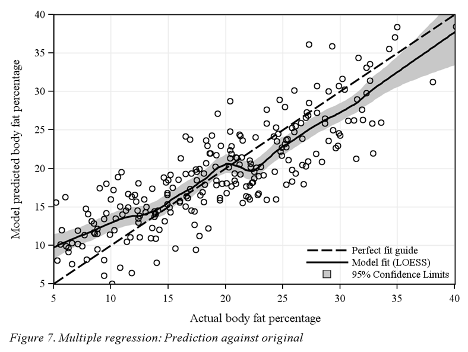

The scatter plots of each model (Figure 6 & 7) display similar Loess curves. For example, both models suffer from some instability at 20% actual body fat. In comparing the suitability of the two models; the multivariate is superior, staying closer to the perfect fit line, not being as flat as the BMI predictions, and accounting for more variance.

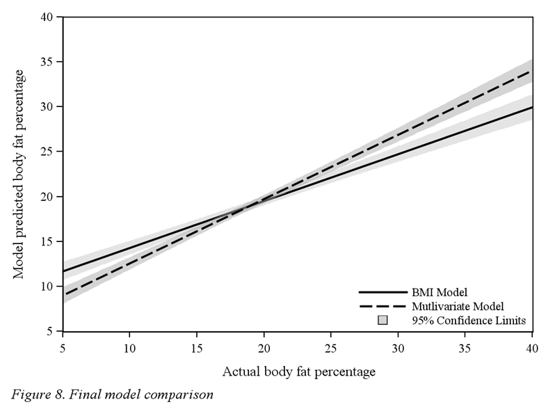

Figure 8 directly compares the two models with linear regressions. The superiority of the multivariate model to the BMI model is clearest when presented in this manner.

Conclusion
==========

The results demonstrated that a small collection of basic dimension variables can be better predictors of BFP than BMI can. In fact, one variable alone (i.e. abdominal circumference) was a better predictor than BMI. This aside, BMI was shown to be a poor mechanism for categorising males into healthy or unhealthy weight groups. Although it is simple to calculate and widely used in research, the way it categorised the sample of males in this paper was grossly inaccurate. Numerous cases with normal BFP where categorised as obese and a few cases with obese or underweight BFP were categorised as normal. While it does have some predictive value these grouping errors need to be addressed for accurate conclusions to be made on the basis of BMI categories.

There are two priorities for further research. Firstly, wherever BMI is used the same populations should be sampled and measured with empirical body fat measurements that can then be compared to the larger sample of BMI results. Secondly, the variables extracted by the multiple regression should be streamlined (i.e. remove non-contributors) and standardised into a statistic in preparation for further comparisons with BMI.

Appendix A. SAS Code
====================

``` sas
LIBNAME SASBMI 'C:\SASBMI';
OPTIONS NOCENTER PAGESIZE=150 LINESIZE=256;
*Reading in raw data from text file and adding labels;
DATA SASBMI.BODYFAT;
INFILE 'C:\SASBMI\bodyfatdata.TXT';
ID=_N_;
INPUT FAT_DENSITY SIRI_BFPER AGE_YEARS WEIGHT_LBS HEIGHT_INCH NECKCIR_CM
CHESTCIR_CM ABDOMENCIR_CM HIPCIR_CM THIGHCIR_CM KNEECIR_CM ANKLECIR_CM
EXTBICIR_CM FOREARMCIR_CM WRISTCIR_CM;
LABEL ID='Case Number'
FAT_DENSITY='Body density determined by underwater weighing'
SIRI_BFPER="Siri's Equation (1956) for body fat percent"
AGE_YEARS='Years old'
WEIGHT_LBS='Weight (lbs)'
HEIGHT_INCH='Height (inches)'
NECKCIR_CM='Neck circumference (cm)'
CHESTCIR_CM='Chest circumference (cm)'
ABDOMENCIR_CM='Abdomen 2 circumference (cm)'
HIPCIR_CM='Hip circumference (cm)'
THIGHCIR_CM='Thigh circumference (cm)'
KNEECIR_CM='Knee circumference (cm)'
ANKLECIR_CM='Ankle circumference (cm)'
EXTBICIR_CM='Biceps (extended) circumference (cm)'
FOREARMCIR_CM='Forearm circumference (cm)'
WRISTCIR_CM='Wrist circumference (cm)';
RUN;
*Checking that raw data was read in correctly;
PROC CONTENTS DATA=SASBMI.BODYFAT; RUN;
PROC PRINT DATA=SASBMI.BODYFAT; RUN;
*Creating custom style, 'MYWAY1', with preferred font for later RTF export;
PROC TEMPLATE;
DEFINE STYLE Styles.MYWAY1;   
PARENT = styles.JOURNAL;
style fonts /   
 'docFont' = ('<serif>, Times Roman',2)  
 'headingFont' = ('<serif>, Times Roman',2,italic)   
 'headingEmphasisFont' = ('<serif>, Times Roman',2,bold italic)  
 'FixedFont' = ('<serif>, Times Roman',2)
 'FixedHeadingFont' = ('<serif>, Times Roman',2,italic)  
 'FixedStrongFont' = ('<serif>, Times Roman',2,bold) 
 'FixedEmphasisFont' = ('<serif>, Times Roman',2,bold italic)
 'EmphasisFont' = ('<serif>, Times Roman',2,italic)  
 'StrongFont' = ('<serif>, Times Roman',2,bold italic)   
 'TitleFont' = ('<serif>, Times Roman',2,bold italic)
 'TitleFont2' = ('<serif>, Times Roman',2,bold italic)   
 'SASTitleFont' = ('<serif>, Times Roman',2,bold italic);
style GraphFonts /  
 'GraphTitleFont' = ('<serif>, Times Roman',11pt) 
 'GraphFootnoteFont' = ('<serif>, Times Roman',10pt)  
 'GraphLabelFont' = ('<serif>, Times Roman',10pt) 
 'GraphUnicodeFont' = ('<serif>, Times Roman',9pt)  
 'GraphValueFont' = ('<serif>, Times Roman',9pt)  
 'GraphDataFont' = ('<serif>, Times Roman',7pt)   
 'GraphAnnoFont' = ('<serif>, Times Roman',10pt);
END; RUN;
*Invoke B&W printing and presentation style and RTF export;
ODS RTF FILE='C:\SASBMI\MYFILE.rtf' STYLE=Styles.MYWAY1;
ODS GRAPHICS ON / RESET border=off HEIGHT=10CM;

**********PART 1: Exploring the dataset for outliers**********;
PROC UNIVARIATE DATA=SASBMI.BODYFAT NOTABCONTENTS NOVARCONTENTS;
VAR FAT_DENSITY SIRI_BFPER AGE_YEARS WEIGHT_LBS HEIGHT_INCH NECKCIR_CM
CHESTCIR_CM ABDOMENCIR_CM HIPCIR_CM THIGHCIR_CM KNEECIR_CM ANKLECIR_CM
EXTBICIR_CM FOREARMCIR_CM WRISTCIR_CM;
RUN;
*cleaning outliers;
DATA CLEANED;
SET SASBMI.BODYFAT;
IF SIRI_BFPER<2.9 OR SIRI_BFPER>41 OR WEIGHT_LBS>300 OR HEIGHT_INCH<60
OR ANKLECIR_CM>33 THEN DELETE;
RUN;
*exporting and plotting skewness and kurtosis;
PROC UNIVARIATE DATA=CLEANED OUTTABLE=OUTTABLE1;
VAR FAT_DENSITY SIRI_BFPER AGE_YEARS WEIGHT_LBS HEIGHT_INCH NECKCIR_CM
CHESTCIR_CM ABDOMENCIR_CM HIPCIR_CM THIGHCIR_CM KNEECIR_CM ANKLECIR_CM
EXTBICIR_CM FOREARMCIR_CM WRISTCIR_CM ;
RUN;
PROC SGPLOT DATA=OUTTABLE1;
REFLINE -1 1 / AXIS=Y LINEATTRS=(COLOR=BLACK PATTERN=2);
VBAR _VAR_ / RESPONSE=_KURT_;
VBAR _VAR_ / RESPONSE=_SKEW_ BARWIDTH=0.5 TRANSPARENCY=0.2;
YAXIS LABEL='Degree of asymmetry & kurtos' VALUES=(-2 TO 2) ;
XAXIS LABEL='Variables';
KEYLEGEND  / NOBORDER LOCATION=INSIDE POSITION=TOPRIGHT;
FOOTNOTE JUSTIFY=LEFT ITALIC 'Figure 1: Measures of asymmetry & kurtosis';
RUN; FOOTNOTE;
*creating new categorical variables and checking frequencies;
PROC FORMAT;
   VALUE BFcustom 0='Underweight' 1='Normal' 2='Obese';
   VALUE BMIcustom 0='Underweight' 1='Normal' 2='Obese';
RUN;
DATA BODYFAT;
SET CLEANED;
FORMAT PER_HEALTH BFcustom. BMI_HEALTH BMIcustom.;
IF SIRI_BFPER<5 THEN PER_HEALTH=0;
ELSE IF SIRI_BFPER>25 THEN PER_HEALTH=2;
ELSE PER_HEALTH=1;
BMI=ROUND((WEIGHT_LBS*703)/(HEIGHT_INCH**2),.01);
IF BMI<18.5 THEN BMI_HEALTH=0;
ELSE IF BMI>25 THEN BMI_HEALTH=2;
ELSE BMI_HEALTH=1;
LABEL PER_HEALTH='Bodyfat% Health Rating' BMI='Body Mass Index' BMI_HEALTH='BMI Health Rating';
RUN;
PROC UNIVARIATE DATA=BODYFAT;
VAR BMI;
RUN;
DATA BODYFAT2;
SET BODYFAT;
IF BMI>39 THEN DELETE;
RUN;
PROC TABULATE DATA=BODYFAT2  format=10.0; 
*VAR PER_HEALTH; 
CLASS PER_HEALTH BMI_HEALTH; 
TABLE PER_HEALTH='' ALL='Total', BMI_HEALTH*(N='') ALL='Total'*(N='') / RTS=25 box='BODY FAT %';
RUN;

**********PART 2: Analysing relationships**********;
*comparing siri with bmi with a scatter plot;
PROC SGPLOT DATA=BODYFAT2;
FOOTNOTE JUSTIFY=LEFT ITALIC "Figure 2. Comparison of measures: Siri's body fat percent vs. BMI";
SCATTER X=BMI Y=SIRI_BFPER / GROUP=PER_HEALTH NAME='SCAT';
REFLINE 25 /  AXIS=X LABEL=('BMI-OBESE') LINEATTRS=(COLOR=BLACK PATTERN=2);
REFLINE 5 25 /  AXIS=Y LABEL=('SIRI-THIN' 'SIRI-OBESE') LINEATTRS=(COLOR=BLACK PATTERN=2);
BAND X=BMI UPPER=42 LOWER=25 / FILLATTRS=(COLOR=GREY) FILL TRANSPARENCY=.9 LEGENDLABEL='OBESE' NAME='BAND';
BAND Y=BMI UPPER=35 LOWER=25 / FILLATTRS=(COLOR=GREY) FILL TRANSPARENCY=.9 LEGENDLABEL='OBESE' ;
YAXIS OFFSETMAX=0;
XAXIS OFFSETMAX=0;
REG X=BMI Y=SIRI_BFPER / NOMARKERS LINEATTRS=(COLOR=BLACK THICKNESS=.01PCT);
KEYLEGEND 'SCAT'/ DOWN=4 TITLE='Siri Rating:' NOBORDER LOCATION=INSIDE POSITION=TOPLEFT;
RUN; FOOTNOTE;
ODS OUTPUT PearsonCorr=ODSCORROUT;
PROC CORR DATA=BODYFAT2 PLOTS(ONLY)=(MATRIX)   NOSIMPLE; *OUT=CORRS;
VAR SIRI_BFPER;
WITH BMI FAT_DENSITY AGE_YEARS WEIGHT_LBS HEIGHT_INCH NECKCIR_CM
CHESTCIR_CM ABDOMENCIR_CM HIPCIR_CM THIGHCIR_CM KNEECIR_CM ANKLECIR_CM
EXTBICIR_CM FOREARMCIR_CM WRISTCIR_CM;
RUN; ODS GRAPHICS OFF;
PROC SORT DATA=ODSCORROUT;
BY SIRI_BFPER;
RUN;
PROC SGPLOT DATA=ODSCORROUT NOAUTOLEGEND;
NEEDLE X=Variable Y=SIRI_BFPER / MARKERATTRS=(COLOR=BLACK SYMBOL=CIRCLEFILLED);
SERIES X=Variable Y=SIRI_BFPER / MARKERS LINEATTRS=(COLOR=WHITE) MARKERATTRS=(SIZE=15 SYMBOL=CIRCLEFILLED);
SERIES X=Variable Y=SIRI_BFPER / MARKERS LINEATTRS=(COLOR=WHITE) MARKERATTRS=(COLOR=WHITE SIZE=10 SYMBOL=CIRCLEFILLED);
YAXIS LABEL='Correllation with Siri body fat percentage' VALUES=(-1 TO 1);
FOOTNOTE JUSTIFY=LEFT ITALIC 'Figure 3. Correlation with Siri's body fat percent';
RUN; FOOTNOTE;

**********PART 3: Group differences**********;
*using dot plots and CLM bars to see differences;
PROC SGPLOT DATA=BODYFAT2;
DOT PER_HEALTH / RESPONSE=AGE_YEARS STAT=MEAN LIMITSTAT=CLM LIMITATTRS=(COLOR=BLACK THICKNESS=2) MARKERATTRS=(COLOR=BLACK SIZE=13) NAME='DOT';
DOT PER_HEALTH / RESPONSE=AGE_YEARS STAT=MEAN MARKERATTRS=(COLOR=WHITE SIZE=10 SYMBOL=CIRCLEFILLED) NAME='LEAVEoffLEGEND';
YAXIS OFFSETMAX=.2 OFFSETMIN=.2 LABEL='Siri body fat categories';
XAXIS OFFSETMAX=0 OFFSETMIN=0 VALUES=(20 TO 60);
KEYLEGEND 'DOT' / NOBORDER LOCATION=INSIDE POSITION=BOTTOM;
FOOTNOTE JUSTIFY=LEFT ITALIC 'Figure 4. Age comparisons across Siri weight categories';
RUN; FOOTNOTE;
PROC SGPLOT DATA=BODYFAT2;
DOT BMI_HEALTH / RESPONSE=AGE_YEARS STAT=MEAN LIMITSTAT=CLM LIMITATTRS=(COLOR=BLACK THICKNESS=2) MARKERATTRS=(COLOR=BLACK SIZE=13) NAME='DOT';
DOT BMI_HEALTH / RESPONSE=AGE_YEARS STAT=MEAN MARKERATTRS=(COLOR=WHITE SIZE=10 SYMBOL=CIRCLEFILLED) NAME='LEAVEoffLEGEND';
YAXIS OFFSETMAX=.3 OFFSETMIN=.3 LABEL='BMI weight categories';
XAXIS OFFSETMAX=0 OFFSETMIN=0 VALUES=(40 TO 50);
KEYLEGEND 'DOT' / NOBORDER LOCATION=INSIDE POSITION=BOTTOM;
FOOTNOTE JUSTIFY=LEFT ITALIC 'Figure 5. Age comparisons across BMI weight categories';
RUN; FOOTNOTE;

**********PART 4: Predictive power**********;
*simple linear regression of SIRI_BFPER with BMI;
PROC REG DATA=BODYFAT2 PLOTS(ONLY)=(DIAGNOSTICS(STATS=ALL) OBSERVEDBYPREDICTED RSTUDENTBYPREDICTED QQPLOT RESIDUALHISTOGRAM COOKSD RESIDUALS);
MODEL SIRI_BFPER = BMI;
OUTPUT OUT=BMI_REG RESIDUAL=REG_RES PREDICTED=REG_PRED;
RUN; QUIT;
PROC SGPLOT DATA=BMI_REG;
FOOTNOTE JUSTIFY=LEFT ITALIC 'Figure 6. BMI linear regression: Prediction against original';
LOESS X=SIRI_BFPER Y=REG_PRED / DEGREE=1 SMOOTH=.2 MARKERATTRS=(COLOR=BLACK) LINEATTRS=(COLOR=BLACK) ALPHA=.05 CLM  LEGENDLABEL='Model fit (LOESS)' NAME='LINE1';
YAXIS GRID OFFSETMAX=0 OFFSETMIN=0 VALUES=(5 TO 40 by 5) LABEL='Model predicted body fat percentage';
XAXIS GRID OFFSETMAX=0 OFFSETMIN=0 VALUES=(5 TO 40 by 5) LABEL='Actual Siri body fat percentage';
REG X=SIRI_BFPER Y=SIRI_BFPER / NOMARKERS LEGENDLABEL='Perfect fit guide' NAME='LINE2';
KEYLEGEND 'LINE2' 'LINE1' / DOWN=3 NOBORDER LOCATION=INSIDE POSITION=BOTTOMRIGHT;
RUN; FOOTNOTE;
*multiple linear regression of SIRI_BFPER with dimension variables;
PROC REG DATA=BODYFAT2 PLOTS(ONLY)=(DIAGNOSTICS(STATS=ALL) OBSERVEDBYPREDICTED RSTUDENTBYPREDICTED QQPLOT RESIDUALHISTOGRAM COOKSD RESIDUALS);
MODEL SIRI_BFPER = AGE_YEARS /*WEIGHT_LBS*/ NECKCIR_CM CHESTCIR_CM ABDOMENCIR_CM HIPCIR_CM THIGHCIR_CM KNEECIR_CM ANKLECIR_CM
EXTBICIR_CM FOREARMCIR_CM WRISTCIR_CM / SELECTION=STEPWISE TOL VIF CP;
OUTPUT OUT=MULTIVAR_REG RESIDUAL=MREG_RES PREDICTED=MREG_PRED;
RUN; QUIT;
PROC SGPLOT DATA=MULTIVAR_REG;
FOOTNOTE JUSTIFY=LEFT ITALIC 'Figure 7. Multiple regression: Prediction against original';
LOESS X=SIRI_BFPER Y=MREG_PRED / DEGREE=1 SMOOTH=.2  MARKERATTRS=(COLOR=BLACK) LINEATTRS=(COLOR=BLACK) ALPHA=.05 CLM LEGENDLABEL='Model fit (LOESS)' NAME='LINE1';
YAXIS GRID OFFSETMAX=0 OFFSETMIN=0 VALUES=(5 TO 40 by 5) LABEL='Model predicted body fat percentage';
XAXIS GRID OFFSETMAX=0 OFFSETMIN=0 VALUES=(5 TO 40 by 5) LABEL='Actual body fat percentage';
REG X=SIRI_BFPER Y=SIRI_BFPER / NOMARKERS LEGENDLABEL='Perfect fit guide' NAME='LINE2';
KEYLEGEND 'LINE2' 'LINE1' / DOWN=3 NOBORDER LOCATION=INSIDE POSITION=BOTTOMRIGHT;
RUN; FOOTNOTE;
*final plotted comparison of models;
DATA REG_COMPARE;
MERGE BMI_REG MULTIVAR_REG;
BY ID;
RUN;
PROC SGPLOT DATA=REG_COMPARE;
FOOTNOTE JUSTIFY=LEFT ITALIC 'Figure 8. Final model comparison';
REG X=SIRI_BFPER Y=REG_PRED / NOMARKERS LINEATTRS=(COLOR=BLACK) ALPHA=.05 CLM CLMTRANSPARENCY=.5 LEGENDLABEL='BMI Model' NAME='LINE1' NOLEGCLM;
REG X=SIRI_BFPER Y=MREG_PRED / NOMARKERS LINEATTRS=(COLOR=BLACK) ALPHA=.05 CLM CLMTRANSPARENCY=.5 LEGENDLABEL='Mutlivariate Model' NAME='LINE2';
YAXIS OFFSETMAX=0 OFFSETMIN=0 VALUES=(5 TO 40 by 5) LABEL='Model predicted body fat percentage';
XAXIS OFFSETMAX=0 OFFSETMIN=0 VALUES=(5 TO 40 by 5) LABEL='Actual body fat percentage';
KEYLEGEND 'LINE1' 'LINE2' / DOWN=5 NOBORDER LOCATION=INSIDE POSITION=BOTTOMRIGHT;
RUN; FOOTNOTE;
*Closing RTF export so SAS produces the RTF file for write-up;
ODS RTF CLOSE; ODS GRAPHICS OFF;
```
