*Random Sampling 'My School' Data*
===========================

In early 2011 the Federal Government of Australia launched the third version of the My School website. By publishing school performance data between 2008 and 2011 this website allows any person to "search the profiles of almost 10,000 Australian schools", "locate statistical and contextual information about schools" and compare schools with "statistically similar schools across the country" (My School, 2012).

The My School website remains controversial. In particular, the investigation of relationships between school funding, type and performance has been a focus of research. This is possible because on each profile, schools are categorised into government (i.e. "operated by the relevant State or Territory government") and non-government sectors (i.e. "not operated by government education departments"; My School Glossary). For example, the VIC Association of State Secondary Principals president Frank Sal wrote for the Herald Sun (Feb28, 2012) that My School data, "clearly shows us that government schools perform as well, if not better, than non-government schools with similar students". Representatives from other Australian States support this relationship. The Adelaide Advertiser (Feb24, 2010) recently reported on the SA Primary Principals Association president Steve Portlock saying that "public schools where we don't have students in the lower (socioeconomic) quartiles we can do as well as private schools."

A criticism of such comparisons is that academic performance data is limited to testing via the NAPLAN (National Assessment Program - Literacy and Numeracy, 2012). Through this testing program, "all students in Years 3, 5, 7 and 9 are assessed on the same days using national tests in Reading, Writing, Language Conventions and Numeracy". According to Brian Chudleigh, a public schools principals' forum official reported in The Daily Telegraph (McDougall, Mar30, 2012), NAPLAN "reduces the value of anything that you can't measure and the curriculum becomes focused on the measurable". Chudleigh says that this will cause schools to focus less on "socialisation, emotional welfare, physical fitness and cultural factors", while encouraging schools to have "two or three lessons every week practising Naplan-style tests".

Given the controversy of the My School website the aim of this study is to compare data from the website for VIC schools to data provided independently by School Administrators. This will produce results allowing conclusions on data quality in addition to allowing researchers with access to the My School database to compare results with a population sample. The method used will be to randomly sample schools from a sampling frame including all VIC schools.

There are two main research questions:

-   What is the estimated mean Per Student Net Recurrent Income (PSNRI) for VIC schools? *quantitative parameter*
-   What is the estimated proportion of schools with over 20% non-English language background students (GT20%NEB)? *proportional parameter*

Some secondary questions will be asked as Extracurricular Applications within the report.

Target Population & Sampling Frame
==================================

The target population is VIC schools. According to the Australian School Directory (2012), the total population of approximately 2500 schools can be divided into three main types that provide the majority of state education. Government schools are the largest group comprising 1613 of the population. The other two largest groups are schools identify as Independent (692) or Catholic (484), with most Independent schools having some religious affiliation. A small number of schools in the population provide specialty education (e.g. gifted, special needs, alternative).

A sampling frame of 954 schools was exported from Wikipedia (2012). The frame includes the name and type of each school. Government schools are separated into primary and secondary levels and this information was retained in the sampling frame. During the analysis phase government schools were only left separate if the primary and secondary school had individual My School profiles. Each school within the sampling frame had a unique ID number assigned.

Checking the Sampling Frame
===========================

Excel was used to assess the quality of the sampling frame and correct discrepancies. Duplicates were identified and removed because schools with multiple listings are more likely to be selected, thus distorting the sampling process. The 'remove duplicates' tool found and removed 11 word-perfect duplicates. The remaining duplicates were harder to identify. Two schools had duplicates in terms of being the same school (one My School profile) but with several campuses. For instance, the Altona and Point Cook campuses of Emmanuel College (Catholic) were listed separately in the sampling frame. The Point Cook campus was also listed a second time mislabelled as Independent. Similar duplicates were removed/combined unless both campuses had separate My School profiles. Such errors were identified through the 'highlight text' function (keyword 'campus') and sort cases (alphabetical).

Whether schools had the correct type (e.g. Independent) was checked next. This was simple as most religious schools have religious names (e.g. 'Holy Saviour') while Government Schools are named by their location (e.g. 'Auburn Primary'). Six errors were found and corrected. After this, correct labelling as secondary or primary was searched for. Both these operations were completed though a combination of sort and highlight text tools. Four secondary schools where mislabelled as primary schools and three additional duplicates where identified and removed during this process.

At this stage of data cleaning there remained only seven suspicious cases that required direct investigation. Of these cases, one independent school (Ballarat and Clarendon College) had the incorrect type and two other cases had been corrected previously (Good Shepherd Lutheran Primary School; Holy Saviour Primary School). The name of one school had an out of date name and was corrected (Ballarat South Community Learning Precinct to Phoenix P12 Community College). Three schools did not exist (Bonbeach High School, Fawkner High School, Maribyrnong High School) and were deleted or renamed to the most likely school without a duplicate in the frame.

Data checking removed 21 cases in total meaning that 933 out of 954 schools remained. The sampling frame was then of acceptable quality for the aims of this study.

Response rates
==============

As the My School website was a contentious issue non-response needed careful monitoring to ensure no systematic bias was introduced into the research. Because this study involved contacted Administrators for pre-existing numerical figures an online approach was the most convenient and accurate. This allowed School Administrators from sampled schools to directly input their data thereby minimising the potential for error. The method selected for this research was to send School Administrators an email invitation that directs them to an internet survey. A follow up call was made to all non-responding schools. They completed the survey and the results were automatically combined into the dataset for analysis.

Citing Fowler, Roman and Di (1998), Fowler (2009: p.76) compared an 82% response rate for prostate surgery patients to surveys with under a 20% response rate. Observing such variability in response rates, Fowler concludes that the response rate for e-mail surveys "depends critically on the population and the survey's purpose". Similar variability is found in other research. Dillman (2007) observed an e-mail response rate close to 60% using a sample of university faculty, while Kaplovitz, Hadlock and Levine (2004) found an email response rate of only 20.5% in a sample of students.

As a sub-population, School Administrators more closely resemble the professional university faculty than younger university students. Moreover, much like the prostate surgery patients, this is an issue of interest to School Administrators. This suggested an email response rate closer to 60% or 82%, rather than 20%, particularly after telephone follow-up of non-responders.

The planned sample size was 25 schools and the expected response rate was 85%. Oversampling ensured that the necessary number of schools were in the achieved sample. Calculations were as follows:

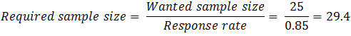

Based on the expected non-response rate 30 schools were sampled (29.4 rounded up). The simple random sample was taken with Excel. Each school in the sampling frame was assigned a random number generated by the software. Schools were then sorted in ascending order by this number and the first 30 schools were selecting as the sample.

Non-response
============

Of the 30 schools included in the random sample only 2 did not respond. The achieved sample was 28 schools and the response rate was 93% (28/30=.93). This means that the assumption of a 15% non-response rate was reasonable, as it was higher than both the expected response rate (i.e. 85%) and those observed in the literature (i.e. 20% to 82%). Such a strong response minimised the chance of systematic bias caused by non-response.

Data Collection & Troubleshooting
=================================

The data collection process was time consuming because the data from the sampled schools could not be automatically exported from the website. Each school had to be individually searched for and have relevant data copied, even though it would be already listed in an inaccessible database from which the website pulls data. This was exacerbated by school names being recorded in the sample file differently than the website, meaning much time was wasted searching the web and using different My School search engines (e.g. suburb search) to match each school with the appropriate profile. Excel was useful in reducing some of the data collection time. Excel functions saved the researcher from doing some tasks by hand, such as automatically producing the dichotomous variable GT20%NEB from the language percentage.

Estimation
==========

Point estimates and confidence intervals were calculated for PSNRI (quantitative) and GT20%NEB (dichotomous). Intervals were calculated with and without the Finite Population Correction Factor (FPC) because of the relatively small population of schools being sampled from without replacement. Also, *t* distribution standard error multipliers were used on account of the small sample size (*n*\<100). Multipliers are as follows:

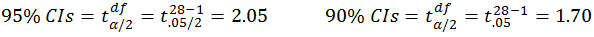

First the quantitative variable PSNRI was estimated followed by the dichotomous variable GT20%NEB. SAS was used to confirm the calculations (Appendix 1 for SAS code, Appendix 2 for SAS results) made with Excel (Appendix 3). The formulas and calculations are below and relevant figures were tabulated in the Results section for interpretation later in the report.

Per Student Net Recurrent Income
--------------------------------

*Sample Mean*

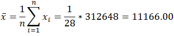

*Variance and Standard Deviation*

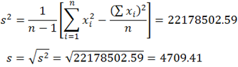

*Standard Error of the Sample Mean*

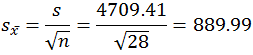

*FPC Standard Error of the Sample Mean*

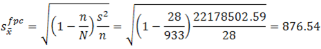

*95% CI of the Sample Mean (Uncorrected)*

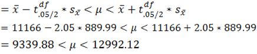

*95% CI of the Sample Mean (FPC)*

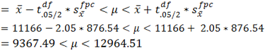

*90% CI of the Sample Mean (Uncorrected)*

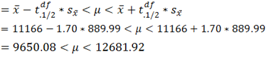

*90% CI of the Sample Mean (FPC)*

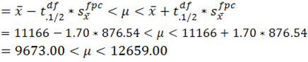

Over 20% non-English Language Background Students
-------------------------------------------------

*Sample Proportion*

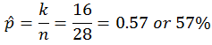

*Variance of the Sample Proportion*

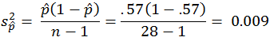

*Standard Error of the Sample Proportion*

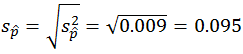

*FPC Standard Error of the Sample Proportion*

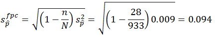

*95% CI of the Sample Proportion (Uncorrected)*

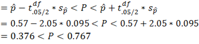

*95% CI of the Sample Proportion (FPC)*

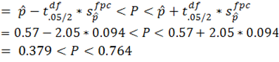

*90% CI of the Sample Proportion (Uncorrected)*

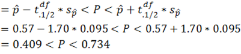

*90% CI of the Sample Proportion (FPC)*

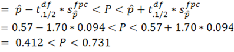

Results
=======

The confidence estimates calculated above are displayed below. The width of each interval was included to facilitate interpretation.

Table 1. *Interval estimates and widths*

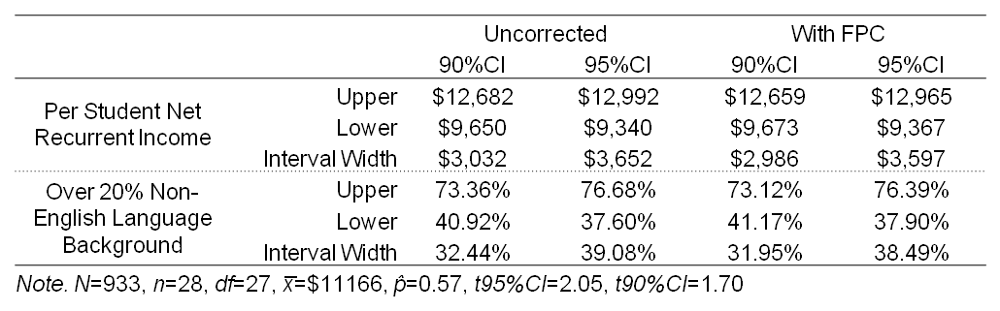

The uncorrected 90%CI of PSNRI can be used as an example of how to interpret mean CIs. Based on this interval it can be stated with 90% confidence that the average PSNRI for the population is between $9,650 and $12,682. This means that if an identical sampling procedure was repeated 10 times, 9 of the 10 intervals calculable would contain the true population mean PSNRI.

The corrected 95%CI of GT20%NEB can be used to show how to interpret proportion CIs. Based on this interval, it can be stated with 95% confidence that the real proportion of schools with GT20%NEB is between 37.90% and 76.39%. This interval is wider than the 90%CI example, and if an identical sampling procedure was repeated 20 times, 19 of the 20 intervals calculable would contain the true GT20%NEB proportion. The six remaining intervals for PSNRI and GT20%NEB can be interpreted in a similar way to these two examples.

Comparing the widths of the CIs was the main feature of these results as most PSNRI and GT20%NEB intervals were relatively wide. Even the corrected 90%CIs, which were the narrowest with the highest precision, were approximately $3000 and 32% wide respectively. Alternatively, using the uncorrected 95%CIs, which were the widest and most conservative; The PSNRI parameter could be as low as $9,367 or as high as $12,965, while the GT20%NEB parameter could be as low as 37.60% and as high as 76.68%. Although these intervals were statistically sound the width of them reduces their value as even inaccurate point estimates from the My School website may fit within them by chance.

Small sample size accounts for much of the interval width and larger sample sizes would result in narrower and more useful intervals. However, it should be noted that the population itself is heterogeneous, with schools having a wide range of funding arrangements and student demographics.

As expected the FPC made intervals narrower and more precise. The difference was only minor (approx. $50 for PSNRI and 0.5% GT20%NEB) due to the small sample and moderate sampling frame (i.e. large sample fraction: 28/933=0.03, 0.03\<0.1). With such a small correction it would be reasonable to leave the FPC out. Although it would be reasonable, it would not be prudent, because it still makes the intervals more precise, is technically appropriate for a hypergeometric distribution such as this, and is of little difficulty to implement when making calculations by computer.

Extracurricular Applications
============================

The results can be used for other applications. Here they are employed to estimate required sample sizes for a specified reduction in CI width (e.g. 25%) and to compare school funding.

Confidence Intervals
--------------------

The width of the 95%CI (FPC) for PSNRI is $3,597. A 25% reduction would be a width of approximately $2,698. When increasing the sample size, variance was assumed to be constant while the *t* multiplier, standard error and sampling fraction were adjusted simultaneously with *n*. Calculations are as follows:

*Multiplier*

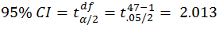

*FPC SE of the Sample Mean (Hypothetical)*

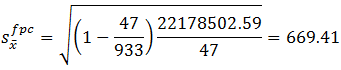

*95% CI of the Sample Mean (FPC and Hypothetical n)*

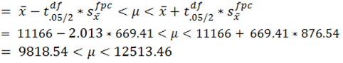

An achieved sample of 47 reduced the width to $2,695 (closest to a 25% reduction). Assuming a 15% non-response rate, a sample of 56 schools (47/0.85=55.29=56 schools) would be necessary to achieve *n*=47.

Comparing Funding
-----------------

The three main types of school in Victoria are Government, Catholic and Independent. How each type is funded varies and parents need to know whether there are differences in school funding, child for child. While it would be impractical and costly to ask every school, this newspaper can ask a small group of schools and estimate what the most likely average funding per student may be. To do this, we randomly selected 7 Catholic, 16 Government and 5 Independent schools, and asked them their funding per student. This provided us with the average funding for each school type, as displayed in the graph below.

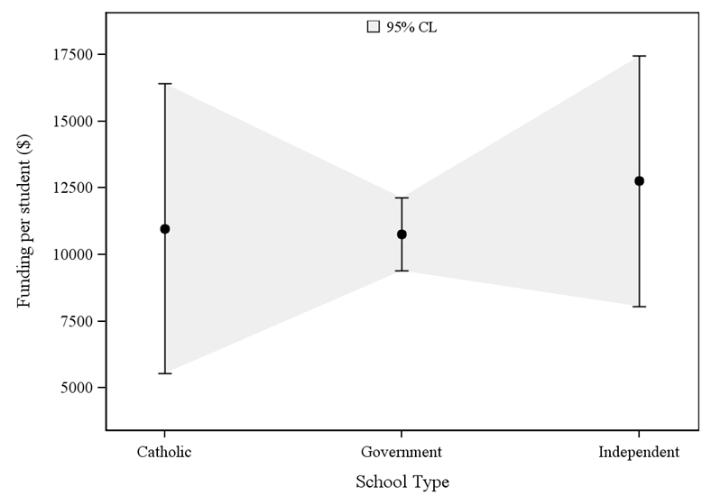

*Figure 1.* Sample Average Funding and Estimated Funding Range

Unfortunately, using 28 schools to make judgements about all schools is risky business. We can't be certain that the funding of the schools we asked accurately reflects all the schools we didn't ask. To deal with this problem, the graph includes 'confidence intervals', the brackets above and below the black dots that signify the average funding for each group. These brackets show, with 95% confidence, where the true population funding average is most likely to be. That is to say, that if we had taken 20 samples just like this one, 19 of them would contain the true average somewhere within those brackets. As the graph shows the brackets are wide and overlap. Since the true average could be anywhere within those brackets, our sample isn't enough evidence to conclude that there are funding difference between school types.

Problems & Improvements for Future Research
===========================================

Firstly, the sample size was too small. This meant that the intervals were so wide that the analysis was uninformative. This was most obvious when comparing school funding, where the groups were as small as five schools only. Future research should aim for larger sample sizes, possibly with achieved samples of *n*\>100. Secondly, data collection was an impediment to using large samples. Future research should try to access a pre-existing database. The My School website could facilitate this by integrating data export features. Finally, newspapers are reporting concerns that focus on quantitative metrics are causing unique non-statistical differences between schools to be ignored. This area has strong potential for research and should be followed up in future research, possibly to inform any quantitative relationships discovered.

Conclusion
==========

The width of the CIs demonstrated how variable school funding and demographics can be. Whatever the point estimates of the My School website are, they will most likely fit well within the wide intervals produced by this sample. Moreover, simple point estimates might be inappropriate for making policy decisions for such a diverse population. Even narrow CIs with precise population estimates may be insufficient for the level of detailed data analysis necessary for funding decisions and to understand student language differences. In light of this, a census that comprehensively covers all the relevant issues may be more appropriate for this population, which supports the data collection and publishing methodology of the My School website.

References
==========

Australian School Directory, State and Education System, Victoria retrieved 20<sup>th</sup> of March 2012 from <http://www.australianschoolsdirectory.com.au/educationinformation.php?region=28>

Dillman, D.A. (2007). *Mail and Internet Surveys: The tailored design method*, 2nd edn, John Wiley, New York.

Fowler, F.J. (2009). *Survey Research Methods*, 4th edn, Sage, USA.

Fowler, F.J., Roman, A.M., Di, Z.X. (1998). 'Mode effects in a survey of Medicare prostate surgery', *Public Opinion Quarterly, 62*, 29-46.

Holderhead, S., Stokes, K. (2012). 'Our public schools up to the mark', *Adelaide Now: The Advertiser*, 24 February, retrieved 25th March 2012 from <http://www.adelaidenow.com.au/news/our-public-schools-up-to-the-mark/story-e6frebvu-1226281053809>

Kaplovitz, M.D., Hadlock, T.D., Levine, R. (2004). 'A Comparison of Web and Mail Survey Response Rates', *Public Opinion Quarterly, 68*, 94-101.

McDougall, B. (2012). 'Too many tests give education system a fail mark', *The Daily Telegraph*, 30 March 2012, retrieved 30th March from <http://www.dailytelegraph.com.au/news/sydney-nsw/too-many-tests-give-education-system-a-fail-mark/story-e6freuzi-1226313938169>

My School website, Australian Curriculum, Assessment and Reporting Authority, retrieved 20th March 2012 from <http://www.myschool.edu.au/>

National Assessment Program - Literacy and Numeracy, 2012, retrieved 29th March 2012 from <http://www.naplan.edu.au/>

Sal, F. (2012). 'Data shows value of public system', *Herald Sun*, 28 February, retrieved 25th March 2012 from <http://www.heraldsun.com.au/ipad/data-shows-value-of-public-system/story-fn6bn88w-1226284490644>

Wikipedia, "List of School in Victoria, Australia", retried 25th of February 2012 from <http://en.wikipedia.org/wiki/List_of_schools_in_Victoria>

Appendix. SAS code
==================

``` sas
OPTIONS NOCENTER PAGESIZE=150 LINESIZE=256  formdlim='-';
DATA SRS;
LENGTH school_type $20;
INPUT school_type $ percap_income langperc_GT20;
LABEL school_type = 'School Type'
percap_income = 'Income Per Student ($)'
langperc_GT20 = 'Greater than 20% non-English Background';
DATALINES;
Catholic264310
Catholic70561
Government 103961
Independent172660
Government 107030
Government76790
Government 124500
Independent189121
Government90761
Catholic71250
Government100451
Government86101
Independent101111
Independent47141
Government 125720
Government120801
Government103460
Catholic155940
Catholic72351
Government 107681
Independent127461
Government79910
Government188380
Catholic70901
Government 128520
Government80731
Catholic62221
Government 96671
;
RUN;
*Creating custom style, 'MYWAY1', with preferred font for later RTF export;
PROC TEMPLATE;
DEFINE STYLE Styles.MYWAY1;   
PARENT = styles.JOURNAL;
style fonts /   
 'docFont' = ('<serif>, Times Roman',2)  
 'headingFont' = ('<serif>, Times Roman',2,italic)   
 'headingEmphasisFont' = ('<serif>, Times Roman',2,bold italic)  
 'FixedFont' = ('<serif>, Times Roman',2)
 'FixedHeadingFont' = ('<serif>, Times Roman',2,italic)  
 'FixedStrongFont' = ('<serif>, Times Roman',2,bold) 
 'FixedEmphasisFont' = ('<serif>, Times Roman',2,bold italic)
 'EmphasisFont' = ('<serif>, Times Roman',2,italic)  
 'StrongFont' = ('<serif>, Times Roman',2,bold italic)   
 'TitleFont' = ('<serif>, Times Roman',2,bold italic)
 'TitleFont2' = ('<serif>, Times Roman',2,bold italic)   
 'SASTitleFont' = ('<serif>, Times Roman',2,bold italic);
style GraphFonts /  
 'GraphTitleFont' = ('<serif>, Times Roman',11pt) 
 'GraphFootnoteFont' = ('<serif>, Times Roman',10pt)  
 'GraphLabelFont' = ('<serif>, Times Roman',10pt) 
 'GraphUnicodeFont' = ('<serif>, Times Roman',9pt)  
 'GraphValueFont' = ('<serif>, Times Roman',9pt)  
 'GraphDataFont' = ('<serif>, Times Roman',7pt)   
 'GraphAnnoFont' = ('<serif>, Times Roman',10pt);
END; RUN;
*Invoke B&W printing and presentation style and RTF export;
ODS RTF FILE='C:\RSMS\MYFILE.rtf' STYLE=Styles.MYWAY1 STARTPAGE=NO;
ODS GRAPHICS ON / RESET border=off HEIGHT=10CM;
PROC SURVEYMEANS DATA=SRS MEAN STDERR CLM;
VAR percap_income langperc_GT20;
RUN;
PROC SURVEYMEANS DATA=SRS MEAN STDERR CLM TOTAL=933;
VAR percap_income langperc_GT20;
RUN;
PROC SURVEYMEANS DATA=SRS MEAN STDERR CLM ALPHA=.1;
VAR percap_income langperc_GT20;
RUN;
PROC SURVEYMEANS DATA=SRS MEAN STDERR CLM ALPHA=.1 TOTAL=933;
VAR percap_income langperc_GT20;
RUN;
PROC SURVEYMEANS DATA=SRS NOBS MEAN STDERR CLM TOTAL=933;
DOMAIN school_type;
VAR percap_income;
ODS OUTPUT DOMAIN(MATCH_ALL)=DOMAIN;
RUN;
PROC SGPLOT DATA=DOMAIN;
YAXIS GRID TYPE=DISCRETE;
YAXIS LABEL='Funding per student ($)' OFFSETMIN=.1 OFFSETMAX=.1;
XAXIS OFFSETMIN=.1 OFFSETMAX=.1;
BAND UPPER=UpperCLMean LOWER=LowerCLMean X=school_type  / TRANSPARENCY=.7 LEGENDLABEL='95% CL' NAME='BAND';
SCATTER Y=Mean x=school_type /   markerattrs=(symbol=circlefilled) Yerrorlower=LowerCLMean Yerrorupper=UpperCLMean;
KEYLEGEND 'BAND' / NOBORDER LOCATION=INSIDE POSITION=TOP;
FOOTNOTE ITALIC JUSTIFY=LEFT 'Sample Average Funding and Estimated Population Funding Range';
RUN; FOOTNOTE;
ODS RTF CLOSE; ODS GRAPHICS OFF;
```
