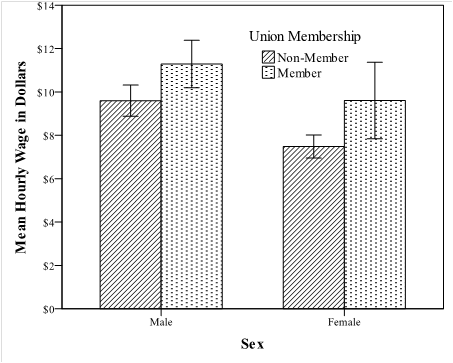

*Accounting for wage differences between males and females in the 1985 Current Population Survey*
=================================================================================================

-   Purpose of the study
-   Data Set
-   Transformation of raw data
-   Sample
-   Number of cases
-   Variables of interest
-   Original variables of interest
-   Computed variables
-   Recoded variables
-   Deleted variables
-   Questions
-   Analysis & Procedures
-   Question 1. Was the data file read in correctly?
-   Question 2. How do wage distributions compare across sex?
-   Question 3: How do wages compare across categorical variables and sex?
-   Question 4: Which scale variables predict wages and how well?
-   Question 5: Is there a partial correlation between sex and wages?
-   Conclusion
-   Appendix A. SPSS Syntax
-   Appendix B. SPSS Generated Codebook


Purpose of the study
====================

The data set is a sample from the 1985 Current Population Survey (CPS85; <http://lib.stat.cmu.edu/datasets/CPS_85_Wages>). The CPS85 was designed to "supplement census information between census years". It measures core employment and demographic information to predict employee wages and identify wage disparities between groups.

The aim of this paper was to explore and explain irregularities in wages between males and females. It involved analysing the dataset to identify the cause of differences, including comparisons of occupation, education, age and union membership. It also assessed the value of experience, age and education in predicting wages, and whether any relationship between sex and wages continued after correcting for differences on specific scale variables.

Data Set
========

Transformation of raw data
--------------------------

The original data and coding information (e.g. value labels, variable names, etc.) was stored as raw ASCII data in text file format (\*.txt file). These data were cut from the file and pasted into another raw text file called 'data.txt' with the text information that was in the original file removed, leaving only data. Variable names were added to the very first line only, for clarity when looking over the text file, and the syntax was adjusted to ensure these words were not read into SPSS.

A syntax code was used to read in the raw data, compute new variables, recode old variables and to add labels and values. The functional syntax file, which doubles as a record of all procedures performed in the analysis, is called 'syntax.sps'. A text copy of the syntax can be found in Appendix A.

The dataset was tab delimited, not isolated to columns, in list form with no missing values, so it was suitable to read it in using the LIST format. The high quality of the data, being very organised and clear in the text file, meant that no initial reviews in Excel or other statistical software were necessary. This quality was later confirmed in SPSS (i.e. no missing cases or detectable errors). A codebook was created through the SPSS Data File Information function and can be found in Appendix B.

Sample
------

These data were sampled from a much larger sampling project, the CPS85. The sample was random and will ensure representativeness provided the number of cases is high enough. A copy of the original questionnaire used to collect the data was not available.

Number of cases
---------------

Exactly 534 cases where included in the dataset. While this is a high number of cases for most social research, it is not unusual for the census style research the CPS85 was substituting for. This large number of cases will ensure population representativeness.

Variables of interest
---------------------

The dataset contained many different metric and categorical variables. Although the text file included 11 variables extracted from the CPS85, only seven variables where necessary in the research. Three additional variables where created via the compute and recode functions during the original syntax read in.

Only the variables of interest in this project where included in the final dataset for analysis in SPSS. When using the LIST syntax function to read in data, the simplest way of keeping these data out of the final dataset was to add a line deleting those variables. Reasons for their deletion are described below.

### Original variables of interest

-   EDU - Years of education (scale): A count of years of education.
-   SEX - Participant's sex (nominal): Male or female.
-   WRK\_EXP - Years of work experience (scale): A count of years worked.
-   UNION - Union membership (nominal): Non-Member or member.
-   HR\_Wage - Hourly wage (scale): Hourly wage earned in dollars. Using an hourly wage avoids the need for corrections based on different total hours worked by males and females.
-   AGE - Participant's age (scale): A count of age in years.
-   OCC\_CAT - Occupational Category (nominal): Management, Sales, Clerical, Service, Professional or Other.

### Computed variables

-   ID - Unique identifier (scale): The dataset lacked a unique identifier for each participant. One was computed, via syntax, to enable analyses requiring the labelling of cases (which is also the reason it was kept at scale level) and to preserve the original order of these data.

### Recoded variables

-   EDU\_CAT - (ordinal): Years of education divided into five meaningful categories based on level of education: Less than high school, high school graduate, some college, college graduate, post-graduate.
-   AGE\_CAT - (ordinal): Age divided into four categories via +/- 1 standard deviation, with cut points calculated through the auto binning function and the syntax pasted and integrated into the initial data read in.

### Deleted variables

-   SOUTH - Does or does not live in southern region (nominal): Deleted because the context of why this variable is significant is unclear (e.g. is that region affluent or poor?). Home location may also be a consequence rather than a predictor of wages.
-   INDUSTRY - Industrial Sector (nominal): Deleted because the occupational category variable is sufficient for this level of research. This variable also has only three categories (i.e. manufacturing, construction, other), compared to the six occupational categories, making the latter a more sensitive measure of differences.
-   MARITAL - Marital Status (nominal): Deleted because variables that might be influenced by marital status were measured such that it should not matter (e.g. coding wages by hourly earnings) or were measured directly and should present in the analysis anyway (e.g. occupational category).
-   RACE - Race (nominal): Deleted because this research aimed to study sex differences and race would be a suitable dependent variable for a separate wages study altogether.

Questions
=========

This project had five research questions:

**Question 1.** Was the data file read in correctly? This ensured the dataset was entered, computed and recoded correctly. It was a quality control measure using raw data pasted into syntax, the list function and case summaries.

**Question 2.** How do wage distributions compare across sex? This compared how wages were distributed for males and females. Explore found outliers to be replaced, while histograms and measures of spread showed the shape of the two distributions.

**Question 3.** How do wages compare across categorical variables and sex? This investigated how sex and membership to certain categories within the categorical variables (i.e. education, occupation, age and union membership) related to wages. It used frequencies to compare the proportion of males and females in each category, contrasted with overall mean wages, and bar graphs to separate average wages within each variable category by sex.

**Question 4.** Which scale variables predict wages and how well? This introduced the scale form of the variables education, work experience and age. A clustered box plot compared distributions and a panelled multi-layered scatter plot used lines of best fit to compare predictive value for males and females.

**Question 5.** Is there a partial correlation between sex and wages? This question first investigated correlations between scale variables. It then finished the data analysis with a partial point-biserial correlation to determine whether the relationship between sex and wages still existed after key scale level variables were controlled for.

Analysis & Procedures
=====================

Question 1. Was the data file read in correctly?
------------------------------------------------

This question compared the first 10 cases of raw data (Table 1), output from the syntax LIST command (Table 2) and output from the case summaries procedure (Table 3). ID was manually moved to the top of the variable list in the Variable View tab for ease of reading and comparison. Missing cases where not excluded, because even though there were none, it might have concealed read in errors to have hidden them. Tables are shown below.

Table 1. *Raw data of all original dataset variables*


Table 2. *LIST output of variables extracted, computed and recoded*


Table 3. *Case Summaries*


The first ten cases were compared and no errors found. The reading, computing and recoding of variables was a success.

A problem encountered was that case summary labels where too long for the word file, and editing in SPSS caused cases to disappear. This was resolved by copying the unaltered table into Word and adjusting fonts and column widths individually.

Question 2. How do wage distributions compare across sex?
---------------------------------------------------------

Wages data were split by sex and the explore procedure produced a table of extreme values. One case (ID number 171) was an extreme outlier of `$44.50` as compared to the next highest case of `$24.98`. It was replaced with the female median `$6.8` (male median = `$8.9`), which was calculated through the frequencies procedure. This process was integrated into the syntax using the IF command.

Histograms for both male and female hourly wages were produced through the legacy dialogues histogram procedure so a saved template could be applied. The chart editor was used to improve the presentation, including using a custom binning width of `$1` and custom anchor of 0.5, to make the histograms uniforms for male and female comparisons, and to prepare them for black and white printing. The template was saved and added to syntax with some minor chart editor changes to pattern prior to copying into Word. These distributions are shown below in Figures 1 and 2.


*Figure 1.* Histogram of male wages, with M, SD, N and normal curve


*Figure 2.* Histogram of female wages, with M, SD, N and normal curve

Compared against normal distribution lines both sexes have a positive skew. The male distribution is the most normal while the female distribution appears to be leptokurtic with a floor effect. The descriptive procedure was used to further compare the spread of these data. It confirmed a higher skew for females (S=1.7; SE=0.16) and a lower skew for males (S=1.0; SE=0.14), as well as higher kurtosis for females (K=3.8; SE=0.31) and almost normal kurtosis for males (K=0.6; SE=0.29). This is reflected in the lower SD for females compared to males.

These analyses confirmed that males earn higher hourly wages than females by both mean and median. It also showed that female wages tended to cluster to the lower end of the distribution rather than being normally distributed.

A problem encountered in this question was a syntax issue where the COMPUTE function failed to reliably change case 171 to MEDIAN(HR\_WAGE). It was resolved by calculating the female median wage and adding it raw to the syntax via an IF command. Another problem was that tests of normality were not useful as with samples of this size they are too sensitive, which was resolved by using other measures of spread (i.e. S, SD and K).

Question 3: How do wages compare across categorical variables and sex?
----------------------------------------------------------------------

The crosstabs procedure was run to compare the membership of males and females across educational, occupational, age and union categories. A compare means procedure showed which categories had the highest mean hourly wage. Tables where combined in Excel to simplify the comparison process and improve presentation.

A problem encountered with this analysis was that using a single combined mean of both sexes concealed the wages earned separately by males and females who were in the same variable category. The combined mean was also distorted by wage inequalities whenever one sex was overrepresented in a certain category. Therefore, bar charts of means separated by sex were used to compare wages across categories for each variable. A template was created in the chart editor and integrated into the syntax to automatically create each subsequent graph in template. The analysis started with educational categories, shown below in Table 4.

Table 4. *Sex comparisons for educational category and mean category wage*


Table 4 showed that the lowest and highest earning educational categories were 'Less than high school' and 'Post-graduate' respectively. Males were overrepresented in both categories. The clearest relationships were that people in higher educational categories had the highest wages and that a lower proportion of females have received any college whatsoever (41.6%) compared to males (45.0%).


*Figure 3.* Mean hourly wage by sex and educational category

Figure 3 clarified the above relationship by showing that males earn more than females even when they have an identical level of education. This extended to all educational categories but 'Post-graduate', where the relationship was weaker. The analysis continued with occupational category, shown below in Table 5.

Table 5. *Sex comparisons for occupational category and mean category wage*


Table 5 showed that almost twice the proportion of females compared to males worked in the occupational category of 'Service', and over three times the proportion in the category of 'Clerical'. These categories had the lowest mean wages. In contrast, almost half of all males worked in the mid to upper wage category of 'Other', and were overrepresented in 'Management', the category with the highest mean wages. Therefore, males were more likely to work in occupational categories with higher wages than females.


*Figure 4.* Mean hourly wage by sex and occupational category

Figure 4 expanded on the above relationships. It showed that even when males and females were matched on occupational category, males still tended to have higher wages. This included all categories other than 'Clerical', in which wages were equivalent. Additional data would be required to further investigate whether both sexes have similar roles within those occupational categories (e.g. Were males and females in 'Other' doing the same work? Were males and females equally likely to pursue and/or receive promotions?). The analysis continued with age category in Table 6.

Table 6. *Sex comparisons for age category and mean category wage*


Table 6 showed that a higher proportion of males were in younger categories with lower wages, while a higher proportion of females were in older categories with higher wages. Despite this, the differences in proportions were not extreme, being almost equal for the '38-39yo' category, so the relationship between sex, age and wage remained unclear.


*Figure 5.* Mean hourly wage by sex and age category

Figure 5 provided a much clearer picture for wage comparison by age and sex than Table 6. It showed that males had higher wages than females for all age categories. This relationship is weakest in the 'Under 25yo' category. While male wages peaked at `$12` in the '38-49yo' category, female wages increased to `$8` and stayed flat for all three older age categories. The observed flattening could have had several causes, including (a) higher male wages in the same occupational categories as females, (b) female overrepresentation within 'Clerical' and 'Service' categories that had both lower wages and less wage variation (i.e. error bar range), and (c) male overrepresentation within the ill-defined 'Other' occupational category, the influence of which was unclear. The analysis continued with union membership in Table 7.

Table 7. *Sex comparisons for union membership and mean category wage*


Table 7 showed that the proportion of males who were union members was twice that of females, and that union members earned more than non-union members.



*Figure 6.* Mean hourly wage by sex and union membership

Figure 6 replicated the common pattern observed in all prior graphs; that males had higher wages than females even when in the same category (i.e. Union Member vs. Non-Member).

Tables 4, 5 and 7 showed that males were more likely to be in higher wage educational, occupational and union membership categories than females. The margins of difference in Table 6 were too small to draw strong conclusions for age categories.

What Figures 3 through 6 showed more clearly than the tables was that males still had higher wages than females even when comparing the same groups within categories. Males appeared to still have higher wages than females, regardless of being matched on education, occupation, age and union membership. This was an interesting finding, given that differences for these variables is often advanced as an explanation for wage inequalities. These results suggested that an unmeasured and unknown variable no included in this dataset was mediating the relationship between sex and wages.

Question 4: Which scale variables predict wages and how well?
-------------------------------------------------------------

This question integrated some of the scale form variables into the analysis. The variables included years of work experience, years of education and years of age. An overview of how these data were distributed is shown below in Figure 7 as a clustered box plot.


Figure 7. *Box plot of scale education, work experience and age*

The figure above showed that the three scale variables had similar distributions when compared across sex. Females were slightly older and more experienced and male education had a lower end outlier. This suggested that differences in wages were not accounted for by any obvious education, experience or age disparity between males and females. The predictive value of these variables was analysed in Figure 8 below.


Figure 8. *Multi-layer scatter plot of education, work experience and age, panelled by sex*

Figure 8, a multi-layered scatter plot panelled by sex with lines of best fit, showed the predictive value of each scale variable for wages. Education was the best predictor of hourly wages. The relationship was strongest for females where education accounted for 24.3% of the variability in wages. In contrast, education accounted for only 12.8% of the variability in male wages. The other two variables, age and experience, were poor predictors compared to education. Age explained a small amount of variability, accounting for 2.5% of the variation in wages for females and 8.0% for males. Experience explained even less, accounting for only 0.3% of variation for females and 3.5% for males, making it the poorest predictor of the three variables.

This demonstrated that for females a greater proportion of wages was explained by known and measurable variables included in this dataset, particularly education. In comparison, education was a poorer predictor for male wages, while age and experience where slightly better predictors. Overall, a greater proportion of male wage variability was left unexplained, left to unmeasured and unknown mediating variables.

A problem encountered with this analysis was difficulty in finding the clearest way of presenting multiple regression lines. Although Figure 8 is complex, it would be suitable for a report style presentation or journal article where space is limited and readers have ample time to study the graphs closely. Another problem uncovered is that extracted SPSS templates do not hold all the information necessary to recreate the graph as shown above. Some minor editing in chart editor before copying the graphs solved this problem.

Question 5: Is there a partial correlation between sex and wages?
-----------------------------------------------------------------

The final analysis used bivariate and partial correlation procedures. A table of correlations was produced, shown below in Table 8, using a two-tailed bivariate Pearson correlation procedure. These confirmed the existence of relationships between the scale variables and sex. All three scale variables were included to determine which were appropriate for the subsequent partial correlation procedure.

Table 8. *Bivariate Pearson Correlations (2 tail); N=534;* \*\* *= Sig. at 0.01;* \* *=Sig. at 0.05*


Table 8 showed a negative point-biserial correlation between sex and wage (*r*<sub>pb</sub>=-.231, *p*`<`.01). With males coded as 0, and females coded as 1, this meant that males tended to have higher wages than females; a relationship well established in prior analyses. This zero-order correlation was used for comparison with the subsequent partial correlation. The correlations with scale variables were also covered in prior analyses; wages tended to increase as education, experience and age increased.

Two new relationships were observed. There was a negative correlation between experience and education, which may have indicated that as people gained higher levels of education they necessarily spent less time working. There was a negative correlation between education and age, which may have indicated that younger people in the dataset have more education than older people. These were not part of the study and were not pursued further.

Analysis of the core research question continued with the partial point-biserial correlation between sex and wages. The multicollinearity between age and work experience (*r*=.978, *p*`<`.01) meant that only one variable could be included in the partial correlation, and including both would have a negligible influence on the partial correlation strength. As age was already reviewed in Question 4 (in categorical form), work experience was selected as the first control variable. The other control variable was education.

There was a highly significant partial point-biserial correlation (*partial r*<sub>pb</sub>=-.289, *p*`<`.001) between sex and wages. The relationship was of medium strength and was even stronger than the original zero-order correlation. This meant that males tended to be paid higher wages than females even after controlling for education and experience and that sex alone accounted for 8.4% of the variability in wages (*R*<sup>2</sup>=.084).

Conclusion
==========

There were three conclusions made from the above analyses.

Firstly, one reason why males had higher wages was because they tended to work in higher paying occupations, were union members, and had slightly higher education levels. Females, in contrast, tended to work in lower paid occupations with lower union membership and less education, in addition to wages flattening across age categories.

Secondly, that the best predictor of higher wages was education, particularly for females. As lesser predictors, age and experience are more important factors in determining wages for males than females.

Thirdly, that sex alone was a factor in determining wages even after controlling for experience and wages. These data could not explain why males tended to earn more when compared to similar females, or why the relationship between sex and wages still existed after controlling for variables usually advanced as explanations for wage disparities.

Although job choice and background explained some variation in wages, sex clearly had an influence (approx. 8%), and future studies should try to identify why (e.g. unique characteristics of male-dominated sectors, sex differences in pro-career activities, sexism).

Appendix A. SPSS Syntax
=======================

``` spss
TITLE 'Current Population Survey of 1985'.
DATA LIST LIST SKIP=1 FILE='C:\data.txt'
/ EDU(F2) SOUTH(F1) SEX(F1) WRK_EXP(F2) UNION(F1) HR_WAGE(DOLLAR2.2) AGE(F2) RACE(F1) OCC_CAT(F1) SECTOR(F1) MARITAL(F1).
COMPUTE
ID=$CASENUM.
RECODE
AGE (MISSING=COPY) (LO THRU 25.1067606107777=1) (LO THRU 36.8333333333334=2) (LO THRU 
48.5599060558890=3) (LO THRU HI=4) (ELSE=SYSMIS) INTO AGE_CAT /
EDU (0 thru 11=1) (12=2) (13 thru 15=3) (16=4) (17 thru Highest=5) INTO EDU_CAT.
FORMATS  ID(F3) AGE_CAT (F1) EDU_CAT (F1).
VARIABLE LEVEL  EDU(SCALE) AGE_CAT(ORDINAL) EDU_CAT(ORDINAL).
VARIABLE LABELS
ID 'ID Number'
EDU 'Years of Education'
SEX 'Sex'
WRK_EXP 'Years of Work Experience'
UNION 'Union Membership'
HR_WAGE 'Hourly Wage in Dollars'
AGE 'Age'
OCC_CAT 'Occupational Category'
AGE_CAT 'Age Category (+/- 1 SD)'
EDU_CAT 'Educational Category'.
VALUE LABELS
SEX 0 'Male' 1 'Female'/
UNION 0 'Non-Member' 1 'Member'/
OCC_CAT 1 'Management' 2 'Sales' 3 'Clerical' 4 'Service' 5 'Professional' 6 'Other'/
AGE_CAT 1 'Under 25yo' 2 '26-37yo' 3 '38-49yo' 4 'Over 50yo'/
 EDU_CAT 1 'Less than HiSch' 2 'HiSch Grad' 3 'Some College' 4 'College Grad' 5 'Post-Graduate'.
EXECUTE.
DELETE VARIABLES SOUTH SECTOR RACE MARITAL.

TITLE 'Data Analysis'.
SUBTITLE 'Question 1'.
COMMENT Unaltered raw data: First 10 cases
EDUSOUTHSEXWRK_EXPUNIONHR_WAGEAGERACEOCC_CATSECTORMARITAL
8012105.1352611
9014204.95573611
1200106.67193610
1200404223600
12001707.5353601
13009113.07283600
10102704.45433600
12009019.47273600
160011013.28333611
1200908.75273600.
LIST
VARIABLES=ALL
/CASES=10.
SUMMARIZE
  /TABLES=ALL
  /FORMAT=LIST NOCASENUM NOTOTAL LIMIT=10
  /TITLE='Case Summaries: First 10 cases'
  /MISSING=INCLUDE VARIABLE
  /CELLS=COUNT.

SUBTITLE 'Question 2'.
SORT CASES  BY SEX.
SPLIT FILE LAYERED BY SEX.
EXAMINE VARIABLES=HR_WAGE
  /ID=ID
  /PLOT NONE
  /STATISTICS EXTREME
  /MISSING LISTWISE
  /NOTOTAL.
IF (ID=171)HR_WAGE=6.8.
FREQUENCIES VARIABLES=HR_WAGE
  /FORMAT=NOTABLE
  /STATISTICS=MEDIAN
  /ORDER=ANALYSIS.
GRAPH
  /HISTOGRAM(NORMAL)=HR_WAGE
  /TEMPLATE='C:\Question 2 histograms.sgt'.
DESCRIPTIVES VARIABLES=HR_WAGE
  /STATISTICS=KURTOSIS SKEWNESS.
SPLIT FILE OFF.
SORT CASES BY ID.

SUBTITLE 'Question 3'.
CROSSTABS
  /TABLES=EDU_CAT OCC_CAT AGE_CAT UNION BY SEX
  /FORMAT=AVALUE TABLES 
  /CELLS=COLUMN
  /COUNT ROUND CELL.
MEANS TABLES=HR_WAGE BY EDU_CAT OCC_CAT AGE_CAT UNION
  /CELLS MEAN.
GRAPH
  /BAR(GROUPED)=MEAN(HR_WAGE) BY SEX BY EDU_CAT
  /INTERVAL CI(95.0)
  /TEMPLATE='C:\Question 3 bar graphs.sgt'.
GRAPH
  /BAR(GROUPED)=MEAN(HR_WAGE) BY SEX BY OCC_CAT
  /INTERVAL CI(95.0)
  /TEMPLATE='C:\Question 3 bar graphs.sgt'.
GRAPH
  /BAR(GROUPED)=MEAN(HR_WAGE) BY SEX BY  AGE_CAT
  /INTERVAL CI(95.0)
  /TEMPLATE='C:\Question 3 bar graphs.sgt'.
GRAPH
  /BAR(GROUPED)=MEAN(HR_WAGE) BY SEX BY  UNION
  /INTERVAL CI(95.0)
  /TEMPLATE='C:\Question 3 bar graphs.sgt'.

SUBTITLE 'Question 4'.
EXAMINE VARIABLES=EDU WRK_EXP AGE BY SEX
  /COMPARE VARIABLE
  /PLOT=BOXPLOT
  /STATISTICS=NONE
  /NOTOTAL
  /ID=ID
  /MISSING=LISTWISE.
GRAPH
  /SCATTERPLOT(OVERLAY)=EDU WRK_EXP AGE WITH HR_WAGE HR_WAGE HR_WAGE (PAIR)
  /PANEL ROWVAR=SEX ROWOP=CROSS
  /MISSING=LISTWISE
  /TEMPLATE='C:\Question 4 scatter.sgt'.

SUBTITLE 'Question 5'.
CORRELATIONS
  /VARIABLES=SEX HR_WAGE EDU WRK_EXP AGE
  /PRINT=TWOTAIL NOSIG
  /MISSING=PAIRWISE.
PARTIAL CORR
  /VARIABLES=HR_WAGE SEX BY WRK_EXP EDU
  /SIGNIFICANCE=TWOTAIL
  /MISSING=LISTWISE.

SUBTITLE 'Codebook'.
DISPLAY DICTIONARY.

SUBTITLE 'End of Analysis'. 
```

Appendix B. SPSS Generated Codebook
===================================

Variable Information, VariablePositionLabelMeasurement LevelRoleColumn WidthAlignmentPrint FormatWrite Format, EDU1Years of EducationScaleInput5RightF2F2, SEX2SexNominalInput5RightF1F1, WRK_EXP3Years of Work ExperienceScaleInput9RightF2F2, UNION4Union MembershipNominalInput7RightF1F1, HR_WAGE5Hourly Wage in DollarsScaleInput9RightDOLLAR4.2DOLLAR4.2, AGE6AgeScaleInput5RightF2F2, OCC_CAT7Occupational CategoryNominalInput9RightF1F1, ID8ID NumberScaleInput10RightF3F3, AGE_CAT9Age Category (+/- 1 SD)OrdinalInput10RightF1F1, EDU_CAT10Educational CategoryOrdinalInput10RightF1F1
